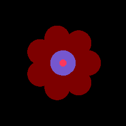

# The Lawn Grower

## Description

This C++ code allows you to generate random lawns pixel art rich in flowers. This will only generate tile-able with variable sizable images.

## How to use

You can compile the code using the provided CmakeLists.txt file.
The compilation will generate a binary file in a build directory that you can run with the following command:

```bash
./LawnGrower.exe
```

The program will then fill up the console with information such as how many grass blades are generated, how many flowers, their colors, etc.

The output image will be generated in the build directory as "generated_lawn.bmp".

## Flower Types

The program will yet generate 2 types of flowers:

- Poppies
- Petaled

---

### Poppies

The poppies are the original flowers that were generated in the first version of the program. They are very basic and are only composed of several circles.

This is an example of the Poppy flower:



---

### Petaled

The petaled flowers are a new type of flower that is more complex and realistic. They are composed with several randomly generated petal types. Here are some examples of generated petals:


Then, the petals are assembled and rotated to form a double crown flower. Here are some examples of generated flowers:


---

## The Lawn

The lawn, before being covered with flowers, is composed of grass blades. The grass blades are generated randomly. There are 3 layers of grass blades. This is an example of a generated lawn (without flowers):


The 3 layers of grass blades are generated with different colors and sizes. They help provide a more realistic look to the lawn.
Here is an example of the 3 layers of grass blades:


---

## The Lawn Grower

The Lawn Grower is a program that generates random lawns with flowers. It is written in C++ and generates BMP images. Here is an example of a generated lawn:


---

## Planned Features

- [ ] Make a GUI
- [ ] Easy possibility to change the size of the generated image
- [ ] Easy possibility to change the number of flowers generated
- [ ] Easy possibility to add new colors
- [ ] Add Json for colors and flower presets
- [ ] Add more flower types
- [ ] Fix weird grass density issue in large lawns
- [ ] Multithread poppy generation
- [x] Multithread petaled flower generation
- [ ] Multithread grass blade generation
- [ ] Make poppy generation based off the same principle as petaled flowers
- [ ] Add new vegetation types (bushes, trees, etc.)
- [ ] Add new lawn types (moss, etc.)
- [ ] Have the ability to base flower density on a noise map

## License

[Creative Commons Attribution 4.0 International License](https://creativecommons.org/licenses/by-nc-sa/4.0/legalcode)

---

## Author Info

- Discord - [TheOddlySeagull](https://discordapp.com/users/374911928428134400)
- GitHub - [TheOddlySeagull](https://github.com/TheOddlySeagull)